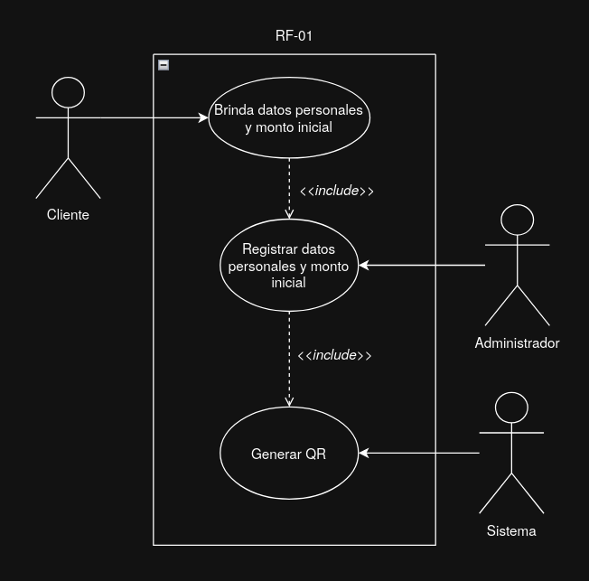
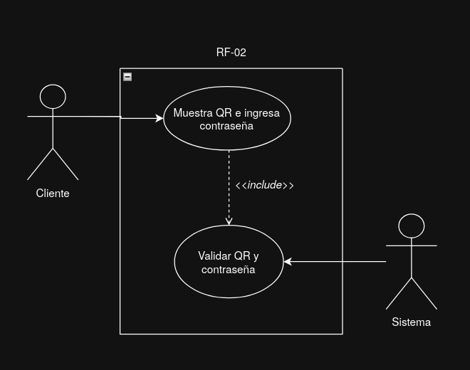
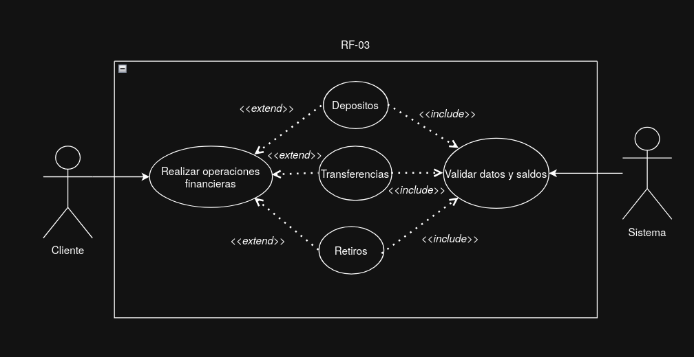
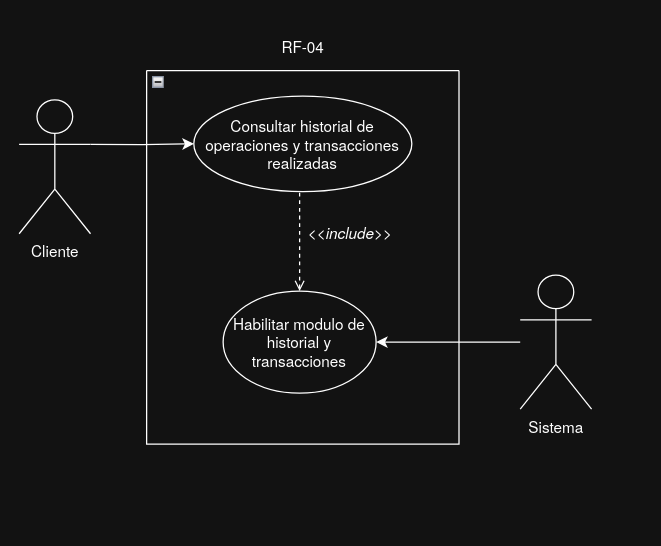
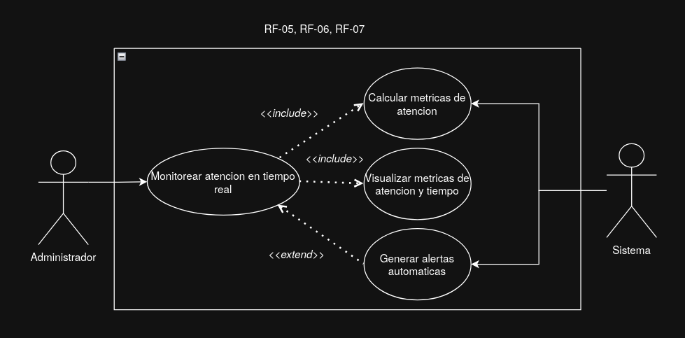

## Diagramas casos de uso

---

# RF-01: El sistema debe permitir al administrador registrar un cliente y generar el código QR con todos sus datos personales y sus montos.

---

# RF-02: El sistema debe validar la identidad del cliente mediante el QR y la contraseña

---

# RF-03: El sistema debe permitir realizar operaciones financieras básicas(depósitos, retiros y transferencias).

---

# RF-04: El sistema debe permitir al cliente consultar el historial de sus operaciones y transacciones realizadas asociadas a su código QR

---

# RF-05 El sistema en el sistema se deben visualizar los tiempos de espera por cliente y la cantidad de clientes atendidos.
# RF-06 El sistema usar algoritmos para monitorear el tiempo real de atención por cliente y la cantidad de clientes atendidos.
# RF-07 El sistema debe generar alertas automáticas si el tiempo promedio de atención excede ciertos umbrales.

